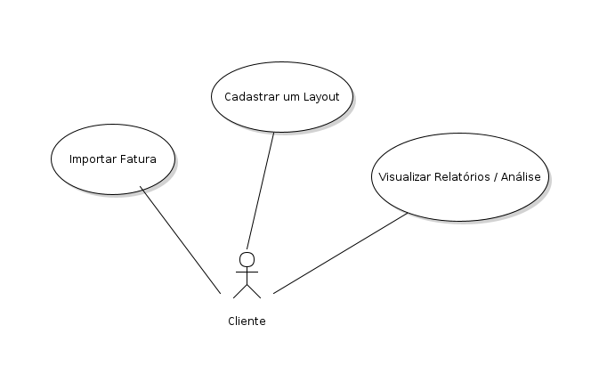
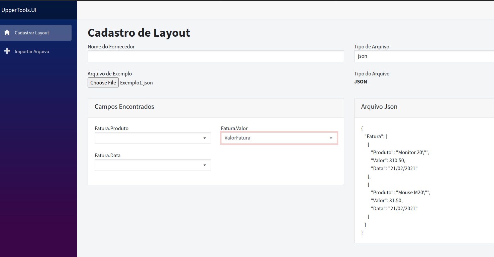

# UpperTools

## Sobre o projeto
### Teste para Processo Seletivo, Uppertools descreve o seguinte Problema:
Um cliente possui diversos tipos de contas que não são gerenciadas: água, energia, taxi, locação de veículos e hospedagem de funcionários. E comumente acarreta problemas como falta de visibilidade dos custos, uso irresponsável dos recursos, multas por atraso no pagamento e muito trabalho para gerar relatórios de rateio dos custos.

Uma dificuldade é que cada fornecedor envia suas faturas em um formato: XLS, CSV, XML, PDF e JSON. Os layouts dos arquivos também variam de fornecedor para fornecedor.

Seu trabalho é projetar uma solução para importar os dados de faturamento de cada fornecedor para um software que irá gerar gráficos, relatórios e análises para os usuários.

É importante que sua solução seja flexível para que seja simples adicionar novos arquivos de novos fornecedores.

É importante você explicar como sua solução poderá escalar para ao mesmo tempo processar diversos arquivos e performar o suficiente para processar arquivos de até 10GB.

## Diagramas
Para descrever o uso do sistema foram criados Diagramas UML

###  Casos de Usos [Gerenciar Fatura](GerenciarFaturas.png) 
Descreve de forma geral como o usuário irá utilizar o Sistema

###  Diagrama de Atividades [Cadastrar Layout](CadastrarLayout.png) 
Um dos requisitos do sistema, é ser flexivel e poder receber novos Layouts. Este diagrama descreve os passos do usuário para incluir um novo Layout de arquivos para ser importado

###  Diagrama de Atividades [Importar Fatura](ImportarFatura.png) 
Este diagrama descreve os passos do usuário para importar uma nova Fatura.

## Sobre a Solução
Esta proposta permite ao usuário incluir diversos layouts para os diversos tipos de arquivos propostos. Podendo para um mesmo tipo de arquivo ter vários Layouts para importação.

Os arquivos não serão armazenados na aplicação, serão descartados após processamento. Somente os dados importantes para emissão dos relatórios serão armazenados em um Banco de Dados, permitindo assim que a aplicação possa processar grandes arquivos.

## Técnologia Escolhida
Para este projeto eu escolhi o Framework Blazor no modo WebAssemly (.net Core 5) 
para desenho da Interface de Usuário. 

O projeto deveria ter uma WebApplication para realizar as operações de armazenar os dados no banco de dados.

Para rodar o Projeto é necessário ter .Net 5.0 instalado (SDK)
E executar o comando na Pasta raiz do Projeto:

 - dotnet run --project ./UpperTools.UI/UpperTools.UI.csproj 

 Depois é só acessar o endereço http://localhost:5003 no Browser

Consegui criar apenas uma das telas de acesso (Cadastrar Layout) neste tempo.

### Cadastro de Layout
Nesta tela o usuário Informa o Nome do Fornecedor, o Tipo do Arquivo e carrega um Arquivo
(Eu adicionei dois arquivos de Exemplo na pasta Exemplo1.json e Exemplo2.)
Ao carregar o arquivo o sistema Lê a estrutura (somente Json) e mostra os campos disponíveis para o usuário Selecionar o Tipo de Dado existente.

##### Realizado por Daniel Guimarães Scatigno